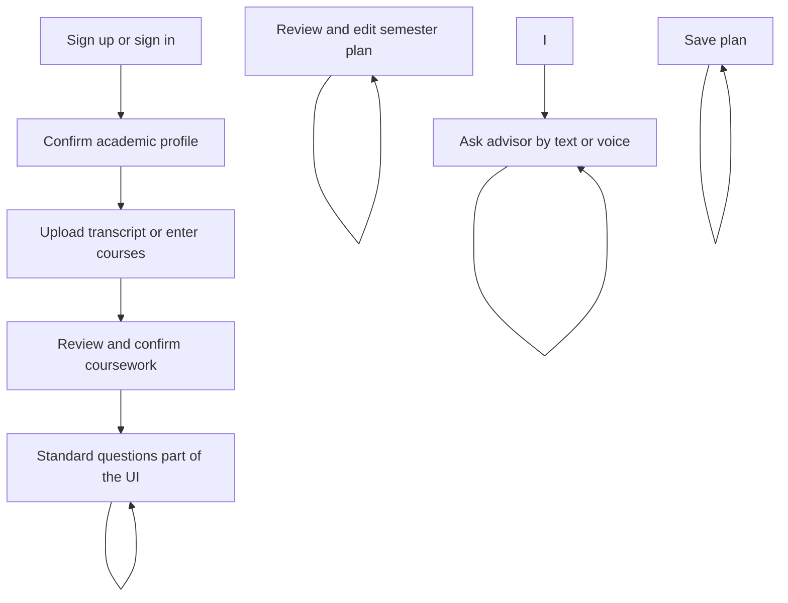
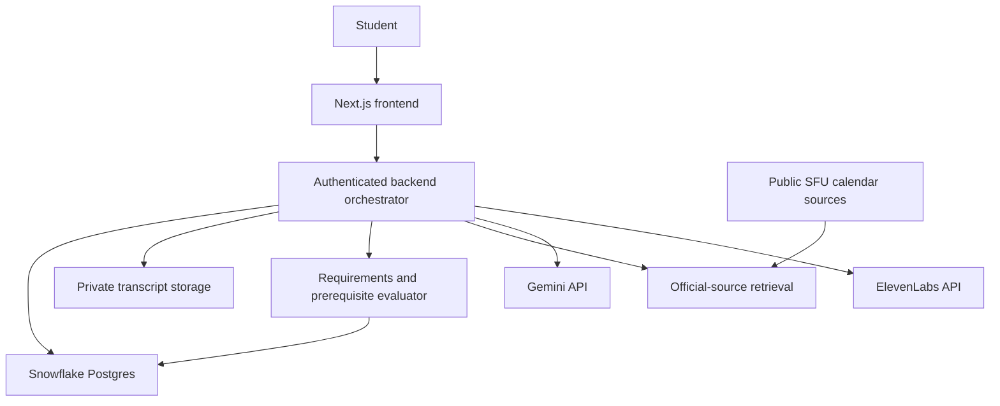

# MyAdvisor

An academic advisor app being built for [StormHacks 2026](https://stormhacks2026.devpost.com/). (Hackathon Project)

MyAdvisor will help students understand their degree progress, choose courses, and plan their next semester using their confirmed academic record and official university requirements. Students will be able to ask questions through text or voice and see the reasoning and sources behind the advice.

**Status: planning and initial scaffolding. The academic advisor is not built yet.** This README describes the intended product and implementation plan. Features and integrations below are planned unless explicitly listed as present.

## The problem

Academic planning requires students to combine their transcript, program requirements, concentration rules, prerequisites, and personal goals. That information is spread across calendars and other university resources. A course choice can affect several requirements and later semesters, making it difficult to understand what to take next.

We want students to answer three questions in one place:

- Where do I stand in my degree?
- What can I take next, and why?
- How would a different course load or course choice change my plan? 
- and much more features

## Initial scope

The first version will focus on **Simon Fraser University’s Bachelor of Business Administration**, using **Fall 2026** requirements. The initial demo student will be in **Finance**.

The requirements dataset also covers Accounting, Innovation and Entrepreneurship, Human Resource Management, International Business, Management Information Systems, Marketing, Operations Management, and Strategic Analysis.

Supporting additional universities, degrees, and requirement terms is a future expansion. Each needs its own verified sources and rules before MyAdvisor can provide a complete degree audit.

## What exists today

| Component | Current state |
| --- | --- |
| Frontend | Next.js starter with React, TypeScript, Tailwind CSS and a basic UI button component. The page still shows starter content. |
| Requirements data | [Requirements.csv](Requirements.csv): 91 source-referenced rules covering BBA core, concentrations, Beedie and university/WQB requirements. Rule encoding and exceptions need team review before use by an evaluator. |
| Product planning | [Proposed user flow](docs/user-flow.md), including onboarding, advising, planning and recovery paths. |
| Authentication and database | Not implemented or connected. |
| Transcript processing, degree audit and planner | Not implemented. |
| Gemini, ElevenLabs and Snowflake API integrations | Not implemented or connected. |
| Deployment and .tech domain | Not configured. |

## Planned student experience



1. **Sign in and set up a profile.** Confirm the university, program, concentration, applicable requirement term, admission pathway, target semester and preferred course load. 
2. **Add an academic record.** Upload a transcript PDF or enter courses manually.
3. **Review extracted information.** Correct course codes, credits, grades and terms before confirming the record. Completed, in-progress and transfer coursework remain distinct.
4. **See degree progress.** Review completed requirements, remaining gaps and unresolved items. Open a requirement to inspect the matching courses and its official source. Then Standard questions by UI
5. **Ask for advice.** Ask questions such as “What should I take next term?”, “Can I take this course?” or “What changes if I take fewer courses?”
6. **Build and save a plan.** Review suggested courses, understand eligibility and warnings, make changes, and explicitly save the semester plan.

Returning students will go to their overview or resume unfinished setup. The proposed main navigation is **Overview**, **Advisor**, **My plan**, and **Academic record**.

## Planned features

| Feature | Intended behavior |
| --- | --- |
| Accounts and profiles | Persist each student’s academic context and isolate their records. Application login is the initial proposal; official SFU SSO remains a separate integration decision. |
| Transcript upload | Use Gemini to extract structured coursework from PDFs, with an editable review step before the data informs advice. |
| Degree audit | Evaluate core, concentration, Beedie and WQB requirements against confirmed coursework. |
| Prerequisite checks | Explain eligible, conditionally eligible, blocked and unresolved courses using curated prerequisite data. |
| Personalised academic chat | Combine student context, computed results and official source material in Gemini answers. |
| Voice advising | Use ElevenLabs for spoken answers, with speech-to-text for spoken questions. Keep readable text alongside audio. |
| Semester planning | Recommend, edit and persist course selections with credit totals and requirement coverage. |
| What-if comparisons | Explore different course loads or course sequences with visible assumptions. |
| History | Reopen saved plans and conversations; recheck plans when the confirmed record changes. |

Later features may include institution-specific GPA scenarios, graduation estimates, sourced deadlines, calendar export, co-op and scholarship guidance, and a summary to bring to a human advisor. These follow the first working transcript-to-plan journey. and much more

## Technology choices

| Layer | Technology | Status and intended role |
| --- | --- | --- |
| Frontend | Next.js 16, React 19, TypeScript, Tailwind CSS 4, shadcn/Base UI | Present in the scaffold; application screens still need implementation. |
| Main LLM | Gemini API | Selected for transcript understanding, grounded answers and planning explanations. No model version is selected yet. |
| Application database | Snowflake Postgres | Selected for profiles, confirmed course attempts, requirements, plans and conversation history. Instance, schema and connection are pending. |
| Voice | ElevenLabs API | Selected for spoken advising; voice choice and input/output integration are pending. |
| Backend | Authenticated API/orchestrator | Planned. FastAPI on AWS Lambda is an option in the team sketch; framework and deployment are not final. |
| Transcript files | Private object storage | Planned. Storage provider and retention policy are pending. |
| Source retrieval | Calendar retrieval, with Snowflake Cortex Search REST API as a proposed option | Search service, source ingestion and track fit still need confirmation. |
| Public site | A .tech domain | Planned for the deployed demo; domain name and hosting are not selected. |

**Snowflake Postgres and the Snowflake REST API have different roles.** The application will connect to Snowflake Postgres using a PostgreSQL connection through the backend. Snowflake documents standard PostgreSQL clients and requires SSL connections. A Snowflake AI/search REST integration would be a separate service call, not the application database connection. [Snowflake Postgres connection documentation](https://docs.snowflake.com/en/user-guide/snowflake-postgres/connecting-to-snowflakepg).

Gemini is the selected main LLM. The earlier handwritten sketch’s Claude label is superseded by this choice.

## Proposed architecture



The backend will resolve the authenticated student’s record, run requirement and prerequisite checks, retrieve relevant source material, and give those results to Gemini for explanation. API keys and database access will stay on the server.

If Cortex Search is adopted, public calendar excerpts will need to be loaded into a Snowflake search service and queried through its REST endpoint. This is additional setup; the app will not assume that Cortex Search automatically indexes its Postgres tables. [Cortex Search API documentation](https://docs.snowflake.com/en/user-guide/snowflake-cortex/cortex-search/query-cortex-search-service).

## Academic data and advising behavior

[Requirements.csv](Requirements.csv) uses these fields:

```text
req_id, program, concentration, catalog_term, group, rule, n_or_units,
courses, filter, min_grade, notes, source_url, status, verified_by
```

The planned database will hold student profiles, transcript metadata, confirmed course attempts, versioned requirements and sources, course/prerequisite data, saved plans, and conversations. Original transcript files will live in private file storage, with database references to them.

Important implementation requirements:

- **Compute academic rules in code.** Credit totals, prerequisites and requirement allocation come from an evaluator; Gemini explains the results.
- **Use confirmed records.** Extraction is a proposal until the student reviews it. In-progress courses do not count as already completed.
- **Preserve exceptions.** P-graded courses, transfer equivalencies, selected-topics courses, residency rules and WQB allocation need explicit handling.
- **Show evidence.** Advice should cite the applicable calendar sources and distinguish verified facts from assumptions or unresolved information.
- **Reconcile record updates.** A replacement transcript should not duplicate course attempts, and affected plans should be rechecked.
- **Keep data scoped to its owner.** Account isolation must apply to records, files, plans and conversation context.
- **Make course availability explicit.** An academic recommendation does not establish section availability, available seats or timetable compatibility. Saving a plan does not enrol the student.

The requirements CSV is a curated starting point, not an executable rules engine. Its descriptive filters and rule vocabulary still need an agreed schema, validated import and meaningful tests. Course prerequisites need separate curation.

## Hackathon tracks we intend to target

These are intended entries, not completed integrations or confirmed eligibility. The [official StormHacks prize page](https://stormhacks2026.devpost.com/#prizes) is the source for the track names and descriptions.

| Track | Planned project use | Remaining work |
| --- | --- | --- |
| Best Use of Snowflake API | Snowflake Postgres for application data; proposed Snowflake REST-based retrieval for sourced advising. | Confirm the qualifying API use with organisers, provision services, and demonstrate an actual API-backed feature. |
| Best Use of Gemini API | Transcript extraction and personalised academic explanations using the Gemini API. | Implement the calls, validate extracted records, and demonstrate grounded responses. |
| Best Use of ElevenLabs | Spoken academic advice and voice interaction tied to the same student context as text chat. | Implement and demonstrate the voice experience. |
| Best .Tech Domain Name | Choose a .tech name that fits MyAdvisor and use it for the deployed project. | Select/register the domain, configure deployment and verify any additional track instructions. |

The published Snowflake track description emphasises AI through Snowflake’s REST API. **We should not assume that using Snowflake Postgres alone establishes eligibility.** Cortex Search is a proposed way to add an API-backed advising feature; its eligibility has not been confirmed. [Track description](https://stormhacks2026.devpost.com/#prizes).

The event requires a project link, a demo video of at most three minutes, and explicit opt-in to each selected track. These submission items still need to be prepared. [Submission requirements](https://stormhacks2026.devpost.com/).

## Development setup

These commands run the **current frontend scaffold**, not the planned advisor integrations.

```bash
git clone git@github.com:swishpaul23/myadvisor.git
cd myadvisor
npm ci
npm run dev
```

Open [http://localhost:3000](http://localhost:3000). The current homepage is `src/app/page.tsx`.

Available scripts:

```bash
npm run dev    # Development server
npm run lint   # ESLint
npm run build  # Production build
npm run start  # Serve an existing production build
```

There is no project test script yet. Consult [package.json](package.json) and the committed lockfile for exact dependency versions.

### Configuration to add during implementation

The integrations will need server-side configuration such as a Postgres connection URL, Gemini API key, ElevenLabs API key and voice ID, authentication/session settings, private storage credentials, and any chosen Snowflake REST authentication. Exact environment-variable names and setup instructions will be documented when the integrations are implemented; the scaffold does not consume these settings yet.

Keep credentials out of source control and browser bundles. Use environment configuration for local development and the deployment platform’s secret storage when hosting the app.

## Build order and demo goal

1. Implement accounts, profile persistence and resumable onboarding.
2. Connect Snowflake Postgres and import validated academic rules.
3. Build transcript/manual entry, extraction review and confirmed coursework.
4. Implement deterministic degree progress and prerequisite checks.
5. Add Gemini advising with relevant source retrieval.
6. Build an editable planner and persistent saved plans.
7. Add ElevenLabs voice, the qualifying Snowflake API feature, and the .tech deployment.
8. Verify the end-to-end journey and prepare the track submissions.

The intended demo follows a Finance student who uploads a synthetic transcript, corrects an extraction issue, discovers an outstanding requirement or prerequisite gap, asks for a manageable next-term plan, edits a recommendation, hears the explanation and saves the plan. Reloading should show the same saved plan.

## Decisions still open

- Authentication provider and whether official SFU SSO is available.
- Backend framework, hosting and private file storage.
- Gemini model, ElevenLabs voice and voice interaction mode.
- Snowflake account/instance access and the qualifying Snowflake REST feature.
- Requirement evaluator format, prerequisite coverage and exception handling.
- Live course-offering data and the limits of graduation estimates.
- .tech domain name and deployment configuration.

## References

- [Proposed user flow](docs/user-flow.md)
- [SFU Fall 2026 BBA calendar](https://www.sfu.ca/students/calendar/2026/fall/programs/business/major/bachelor-of-business-administration.html)
- [SFU Fall 2026 WQB requirements](https://www.sfu.ca/students/calendar/2026/fall/fees-and-regulations/enrolment/WQB.html)
- [Gemini PDF understanding](https://ai.google.dev/gemini-api/docs/document-processing)
- [ElevenLabs text-to-speech](https://elevenlabs.io/docs/overview/capabilities/text-to-speech)
- [ElevenLabs speech-to-text](https://elevenlabs.io/docs/overview/capabilities/speech-to-text)
- [StormHacks tracks and prizes](https://stormhacks2026.devpost.com/#prizes)
