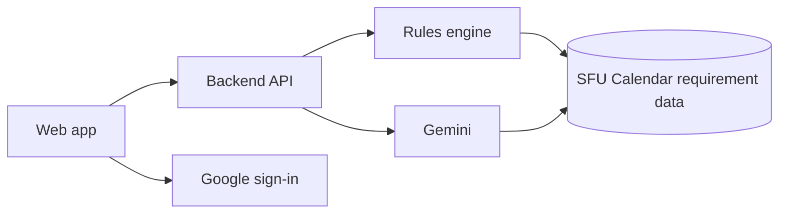

# MyAdvisor

**Plan your degree, term by term.**

MyAdvisor is an SFU degree-planning web app. Add the courses you've completed, see exactly where you stand against your program requirements, and get a term-by-term plan through to graduation. Every answer shows its source in the SFU Calendar.

Built for a 24-hour hackathon.

## Features

- **Student setup:** enter your program and the courses you've completed (or upload a sample transcript).
- **Degree audit:** a progress bar and status for every requirement, with gaps called out and cited to the Calendar.
- **Plan generator:** a multi-term plan covering your remaining requirements. Set the start term, courses per term, summer terms and co-op.
- **Drag-and-drop planner:** move courses between terms. Moves that break a rule are allowed but flagged in red with the reason.
- **Advisor chat:** ask questions like "Do I still need BUS 393?" and get an answer that cites the SFU Calendar.

## Screenshots

### Degree progress

Each requirement shows its status: complete, in progress, or a gap. Gaps expand into an action card naming the missing course and linking to the Calendar source.

### My plan

Courses are grouped by term with unit totals. Each course shows which requirement it closes, and rule breaks (such as a term below the 9-unit full-time minimum) are flagged inline.

## Scope

| | |
|---|---|
| Program | BBA, Finance concentration (Beedie School of Business) |
| Calendar | SFU Fall 2026 |
| Demo data | A made-up sample student |

Plans are a planning aid, not enrolment. Seats and timetables are not checked, and requirement data has not been verified by an academic advisor. Always confirm with an SFU advisor.

## Architecture

**Rules engine is the source of truth.** Degree audits, plan generation and rule-break checks are deterministic code run against structured requirement data from the SFU Fall 2026 Calendar. The same inputs always give the same audit, and every result carries a citation back to the Calendar.

**The LLM explains; it doesn't decide.** Gemini powers the advisor chat. It is grounded in the same requirement data and the student's record, so answers like "Do I still need BUS 393?" match what the audit shows and cite the Calendar.

**Plan moves are validated, not blocked.** When a course is dragged between terms, the rules engine re-checks the plan and returns any violations (prerequisites, unit minimums, requirement coverage). The UI flags them in red with the reason.

## Stack

| Layer | Choice |
|---|---|
| Hosting | Vercel |
| Auth | Google sign-in |
| LLM | Gemini |
| Rules and audit | Custom rules engine over structured Calendar data |
| Data | Static SFU Fall 2026 requirement data for BBA Finance |

## Live demo

Deployed on Vercel: **<[your-vercel-url](https://myadvisor-rosy.vercel.app/)>**

Open the site and choose **Try the sample student** to explore without uploading anything.

## Team

- **Stuart:** backend (rules engine, LLM), sign-in, app UI
- **Vaibhav:** landing page, design, pitch
