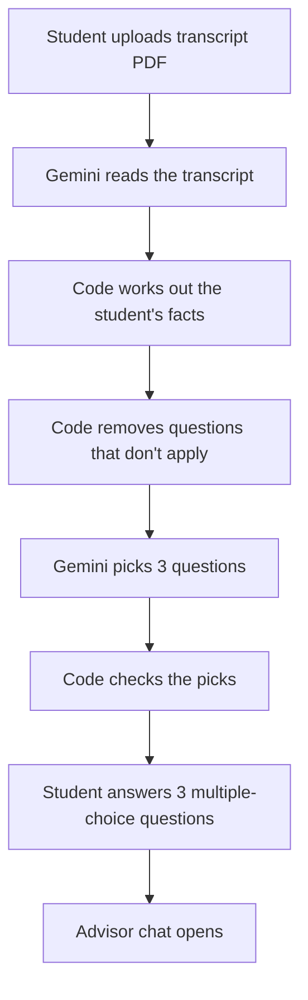

# MyAdvisor: intake survey plan

Finalised plan for the demo. **Not built yet.** It covers what happens between transcript upload and the advisor chat: Gemini reads the transcript, picks 3 questions tailored to the student, and the student's answers shape the chat.

The question list itself is not written yet. The team will decide it later.

## Scope

- SFU undergraduate students only.
- Transfer students are treated like everyone else. Courses and credits on their transcript count like any SFU course. Generic transfer codes such as `CMPT 1XX` count as general units at that subject and level; they can't satisfy a requirement for a specific course.
- Out of scope: résumés, co-op and career questions, exchange, and students transferring out of SFU.

## Process

1. **Student uploads the transcript PDF.**
2. **Gemini reads it** and returns structured course rows: course code, title, credits, grade, term, and status (completed or in progress). It also returns CGPA and academic standing when they are printed on the transcript.
3. **Code works out the student's facts** (see [Student facts](#student-facts)). No AI is involved in this step.
4. **Code removes questions that don't apply** to this student, using each question's rules. Gemini never sees those questions.
5. **Gemini picks exactly 3 questions** from the remaining list and fills them in with the student's details.
6. **Code checks the picks** (see [Checks and fallback](#checks-and-fallback)).
7. **Student answers the 3 questions.** One question at a time. Each answer is saved as it is given, so a student who leaves halfway resumes where they stopped.
8. **The advisor chat opens** with the student summary, the computed progress, the answers, and any topics left for the chat to raise.

## Student facts

Code computes these from the extracted transcript. They decide which questions are allowed and give Gemini a summary instead of the raw transcript.

| Fact | Values |
| --- | --- |
| Stage (completed units) | Exploring 0–29, Committing 30–59, Building 60–89, Finishing 90+ |
| Performance (CGPA) | At risk (below 2.0, or on probation), Fragile 2.0–2.49, Solid 2.5–3.49, Strong 3.5+ |
| Trend (last term GPA compared with CGPA) | Dropping (0.5 or more lower), Steady, Rising (0.5 or more higher) |
| Flags | Undeclared program, has a minor, 2+ withdrawals, failed a required course, break of 2+ terms, behind on writing/quantitative/breadth requirements, short of the 44 upper-division units |
| Subject mix | Courses and units by subject, including the top subject outside the major |

The cut-offs are starting points and can be adjusted.

## The survey

- **Exactly 3 questions**, all chosen by Gemini for this student. There is no fixed question asked to everyone.
- **Each question is multiple choice:** exactly 4 options plus a **Skip** option. The student picks one option. There are no typed answers.
- **Options can come from the transcript.** For example, "Which of these did you enjoy most?" can list 4 of the student's own courses.
- **Questions must fit the student.** Code removes questions that don't fit before Gemini sees the list. For example, a Finishing student is never asked which program to choose, and an At-risk student isn't asked about honours.
- **Each question shows a one-line "why I'm asking"** so the survey feels like an advisor, not a form.

Example of the tailoring (illustrative, not the final questions):

| Student | Likely picks |
| --- | --- |
| Second-year, Strong, undeclared, many PSYC courses | Program being considered · interest in a PSYC minor · course enjoyed most |
| Fourth-year Finance, Solid, requirement gaps left | Summer courses to finish on time · subject preference for the remaining gaps · final-term load |
| First-year, At risk, dropping | Knows how to return to good standing · what changed last term · course load next term |

## Question list format

Each question in the predetermined list needs:

| Field | Purpose |
| --- | --- |
| `id` | Stable identifier Gemini returns |
| `text` | Wording, with variants per stage where needed and slots like `{subject}` |
| `options` | Exactly 4 options, fixed or filled from the transcript |
| `allowed_when` | Stages, performance bands, trend, and flags where it may be asked |
| `never_when` | Hard exclusions, e.g. Finishing for program-choice questions |
| `priority` | Used for ranking and for the fallback |
| `why` | The "why I'm asking" line |

## Gemini selection call

**Input:** the student facts and summary from code (not the raw transcript) and the questions that passed the filter.

**Output (structured):**

- 3 question IDs, in order.
- For each: filled-in wording, the 4 options, and the "why I'm asking" line.
- A short student summary for the chat.
- Up to 3 topics for the chat to raise later, from relevant questions that weren't picked.

## Checks and fallback

Code accepts Gemini's output only when:

- there are exactly 3 questions;
- every ID is from the filtered list;
- every question has exactly 4 options plus Skip;
- any option taken from the transcript, such as a course code, really is on the transcript.

If the call fails or the output doesn't pass, the survey uses the 3 highest-priority questions that passed the filter, with default wording. Onboarding never gets stuck on Gemini.

## Handoff to chat

The chat's first context includes the student summary, the extracted courses, computed progress, the 3 answers, and the topics to raise later. A skipped question is added to those topics. The chat's first message plays the answers back, for example: "You want to finish by Spring 2028 and you're curious about a PSYC minor. Want to start with next term's plan?"

## Still to decide

- The question list itself.

## Differs from current docs

These decisions differ from [AGENTS.md](../AGENTS.md), [README.md](../README.md), and [user-flow.md](user-flow.md), which should be updated to match:

- There is no student review step after extraction. The docs currently require reviewed, confirmed records before advising, and the README demo story includes correcting an extraction issue.
- Transfer coursework is treated like SFU coursework. The docs currently keep it distinct and require explicit transfer-equivalency handling.
- Scope is SFU undergraduates, not only the BBA.
