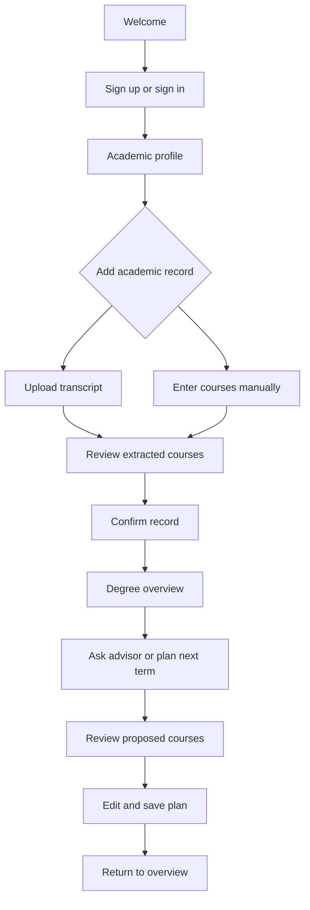

# MyAdvisor: proposed student user flow

Proposal for team review. Initial scope: SFU BBA, with Finance as the demo concentration.

## Student outcome

A student can see what they have completed, understand what remains, and save a realistic next-term plan with an explanation of each recommendation.

The main journey is: sign in → set academic context → confirm coursework → see degree progress → ask for advice → review and save a plan.

## First visit

| Screen | What the student does | Main action | Next state |
| --- | --- | --- | --- |
| Welcome | Understands the promise: know what is left and plan what comes next. | Get started | Authentication |
| Authentication | Creates an account or signs in. | Continue | New students enter setup; returning students enter overview. |
| Academic profile | Confirms university, degree, concentration, applicable requirement term and admission pathway. Picks the term to plan and preferred course load. | Continue | Record setup |
| Add academic record | Uploads a transcript PDF or enters coursework manually. Sees why the record is needed and how it will be used. | Upload transcript | Extraction progress, then review |
| Review record | Checks course codes, credits, grades, terms and completed/in-progress/transfer status. Corrects flagged fields. | Confirm record | Progress calculation |
| Degree overview | Sees completed and outstanding requirements, unresolved items and their saved next-term plan. | Plan next term | Advisor/planner |
| Advisor | Asks a question through text or optional voice; receives an answer tied to confirmed records and cited calendar rules. | Review suggested plan | Course proposal |
| Review proposed plan | Reviews each suggested course, requirement satisfied, eligibility and unknowns. Adds, removes or swaps courses. | Save plan | Saved plan and updated overview |

Requirement terms should be confirmed, not guessed from the student's current year. University, faculty and concentration requirement terms can differ ([SFU requirement-term policy](https://www.sfu.ca/students/calendar/2026/fall/fees-and-regulations/credentials-offered/definitions.html)). The hackathon demo can use a clearly identified Fall 2026 profile.

## Authentication choice

The sketch mentions SFU login. For the first build: Google sign-in via Auth.js (decided by Stuart, 2026-10-04). (Earlier proposal: application sign-in with email.) Label a university connection as SFU SSO only once that integration exists. An SFU email address alone does not establish access to a student's university record.

Use a separate, clearly labelled sample student for the demo. A sample record must never appear as an uploaded personal transcript.

## Record review is a required checkpoint

Show extracted coursework in an editable table. Keep the source document/page available for checking flagged values. Distinguish recognition of a course from approval of a transfer equivalency.

Progress uses the confirmed record. In-progress coursework appears separately and can inform a conditional future plan, but does not count as already completed.

Allow a student to skip the transcript and enter courses manually. If they have not provided a record, the advisor can answer general program questions while clearly showing that degree progress and personalised eligibility are unavailable.

## Degree overview

Keep the first screen focused on the student's situation:

- Completed credits and applicable degree minimum.
- Lower core, upper core, concentration, Beedie and WQB progress.
- Outstanding requirements with the courses or units that can fulfil them.
- Unresolved items, such as unconfirmed transfer credit or unclear course topics.
- A next-term plan preview, with one clear action to create or continue the plan.

Each requirement opens its rule, matching coursework, remaining gap and source. Do not add overlapping requirement totals together as if they were separate earned credits.

## Advisor and planning loop

1. Student asks, for example, “What should I take next term?” or “Can I take BUS 412?”
2. Advisor uses the confirmed academic profile, coursework and current plan.
3. Rules evaluate requirements and prerequisites; retrieval provides the relevant calendar evidence.
4. Advisor explains the result, with expandable sources and a clear distinction between eligible, conditionally eligible, blocked and unresolved courses.
5. Student chooses **Review suggested plan**. A suggestion does not automatically replace a saved plan.
6. Planner presents course cards with credit load, the requirement fulfilled and why each course was suggested.
7. Student edits the selection. Rules recompute the affected warnings and totals.
8. Student explicitly saves the plan. The app confirms the save and returns to the overview or plan detail.

Text and voice use the same conversation and academic context. Show a voice question as editable text before submission, provide readable answers alongside audio, and keep text usable if microphone access is declined or speech fails.

Course recommendations do not establish that a section is offered, has seats, or fits a timetable. Display availability as unknown until verified offering data is connected. Saving a plan does not enrol the student.

## Returning visit

Sign in → degree overview → continue the saved plan or conversation.

If setup is unfinished, resume at the unfinished step. If a student uploads a newer transcript, review it and reconcile course attempts before applying changes. Do not append the same completed course a second time. Recheck the saved plan after confirmed record or profile changes, preserving the previous plan and showing what needs attention.

## Navigation

Use four main destinations:

- **Overview:** progress and next actions.
- **Advisor:** text/voice conversations and sources.
- **My plan:** draft and saved semester plans.
- **Academic record:** transcript, confirmed coursework and corrections.

Put profile, university/program settings and sign-out in the account menu. Course search and comparisons belong inside the planner initially.

## Recovery paths

| Situation | Student-facing response | Recovery |
| --- | --- | --- |
| Unsupported or unreadable upload | Explain which file could not be processed. | Retry with a supported PDF or enter courses manually. |
| Uncertain extraction | Flag the affected values rather than accepting guesses. | Correct and confirm the record. |
| Transfer equivalency or selected topic unknown | Keep the affected requirement unresolved. | Add approved information or prepare a question for a human advisor. |
| Missing calendar coverage | State which program/term lacks rules. | Answer sourced general questions; avoid claiming a complete audit. |
| Advisor service unavailable | Preserve the student's question and existing record/plan. | Retry; keep deterministic progress and planner checks usable. |
| Plan has a blocked or unresolved course | Explain the unmet condition beside that course. | Swap it, or save an explicitly labelled draft with outstanding warnings. |
| Save fails | Keep edits visible and distinguish unsaved from saved. | Retry saving. |

## Hackathon implementation order

1. Account/profile persistence and resumable setup.
2. Transcript/manual entry → review → confirmed course record.
3. Degree overview using the curated BBA requirements.
4. Grounded text advisor and course proposal.
5. Editable semester planner and saved plan.
6. ElevenLabs voice, then course-load comparison and export for an advisor meeting.

The first end-to-end demo should work before expanding into scholarships, co-op, reminders or live course registration.

## Demo story

A Finance student signs in, confirms their profile, uploads a synthetic transcript, corrects one extraction error and views outstanding requirements. They ask for a manageable next-term plan, inspect why a course is blocked, swap a suggestion, hear the explanation and save the revised plan. On reload, the overview shows the saved plan.

## Relationship to the teammate's sketch

The attached note describes a frontend sending questions and course history to a backend orchestrator, with an LLM, a rules layer and retrieval backed by a database. This proposed flow gives those components visible student outcomes: a confirmed record, explainable progress, grounded advice and a saved plan.

Infrastructure choices are provisional. The note labels the LLM as Claude; the earlier project brief requested Gemini. The user flow supports either and does not change that provider decision. The frontend repository currently contains a Next.js starter; backend hosting, official SSO, transcript extraction and voice are proposed integrations, not existing capabilities.

## Team decisions before screen implementation

- Confirm whether an official SFU SSO integration is available. (Google sign-in via Auth.js (decided by Stuart, 2026-10-04).)
- Confirm Gemini versus the sketch's Claude label.
- Confirm the demo student's requirement term, admission pathway and transcript fixture.
- Agree on approved rule/filter encoding, prerequisite data and source coverage before presenting course eligibility as validated.
- Confirm how the frontend calls the backend orchestrator and how authenticated student context is resolved.
